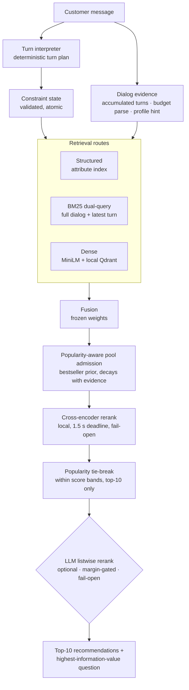

# Shopping Copilot — TechJam 2026 Track 4

A conversational shopping agent that finds a hidden target product in a
50,000-item catalog within 10 turns — retrieval conditioned on the whole
dialog, questions chosen by information value, and every optimization gated
by adversarial robustness tests instead of benchmark fit.

## For judges — run it

Python 3.11.9. No API key needed; the default agent is fully offline.

```bash
python3 -m venv .venv && source .venv/bin/activate
pip install -r requirements-dense.txt

# catalog: download catalog.jsonl.gz from the GitHub Release, verify SHA256SUMS
gzip -dk catalog.jsonl.gz && mv catalog.jsonl data/catalog.jsonl

# local models (pinned revisions) + dense index
python -m tools.fetch_model
python -m tools.fetch_model \
  --identity cross-encoder/ms-marco-MiniLM-L-6-v2 \
  --destination models/cross-encoder__ms-marco-MiniLM-L-6-v2 \
  --revision 233902d25c440f23af6f7d6e94d2946bac0bee0a
python -m retrieval.build_dense_index --catalog data/catalog.jsonl --verify-load

# official score, all 200 public sessions
python -m evaluator.local_evaluator

# one annotated live session
python -m tools.demo_session --sample public_0044
```

## Results

**The only valid score is the official evaluator's own output** — the
`python -m evaluator.local_evaluator` command above, which we never modify.
TechnicalScore = 0.5·HitRate@10 + 0.3·MRR + 0.2·Efficiency, all 200 public
sessions. Weak BM25 starter baseline: 0.107.

| Official score (unmodified evaluator) | TechnicalScore | HitRate@10 | MRR | MTTC | p95/turn | Cost |
| --- | ---: | ---: | ---: | ---: | ---: | ---: |
| Offline (default) | **0.756** | 0.910 | 0.588 | 4.79 | 0.8 s | $0 |
| + gpt-5.4-mini rerank (opt-in) | **0.771** | 0.910 | 0.638 | 4.75 | ~4.6 s | ~$0.02/session |

Supplementary anti-overfitting evidence (not the official metric): we replay
the same unmodified `evaluate()` scorer under two stress conditions —
customer messages fully reworded before the agent sees them, and 100
generated sessions whose targets appear in no public label. A score that
collapses there is benchmark fit, not shopping competence; ours holds
(offline 0.725 paraphrased / 0.718 novel; connected 0.740 / 0.756).
Run-to-run noise is ±0.013, quantified from identical-code runs.

```bash
python -m tools.robustness_eval --output benchmarks/robustness.json
python -m unittest discover -s tests   # 218 tests
```

## Architecture




Every model stage fails open to a deterministic path: the agent cannot crash,
hang, or emit an invalid response because a model misbehaved. Key behaviors:

- **Dialog accumulation** — retrieval sees everything the customer said,
  minus superseded constraints (intent overrides drop replaced terms).
- **Information-value clarification** — each question maximally splits the
  live candidate pool; answered or dismissed attributes are never re-asked.
- **Popularity prior** — the hidden target is a real purchase; among
  near-identical listings a Bayesian bestseller prior is the honest
  tie-breaker. Weight decays as the customer states requirements.
- **Budget understanding** — "under $50", "around $60" reorder toward
  in-budget products without eliminating unpriced ones.

## Honest-optimization discipline

Reward-hacking prevention is a release gate, not an afterthought:

- Production code contains no evaluator imports, no simulator template
  knowledge, no per-session logic — verified by an independent adversarial
  review (see `docs/ENGINEERING_JOURNAL.md`).
- Exact / paraphrased / novel-target conditions are always reported
  separately; a gain that dies under rewording never ships.
- Every lever is documented with its measurement in
  `docs/honest_optimizations.md` — including the rejected ones, and a
  simulator-coupled route that scored 0.9628 and was deleted as reward
  hacking (the private sessions use separate users and targets; coupled
  scores would not survive them).

## Optional connected mode

`gpt-5.4-mini` listwise reranking (and experimental nano chunk-tournament /
query-rewrite stages) via the OpenAI Responses API: `store=false`, strict
JSON-schema outputs, per-call budget reservation under a $10 cap, no
retries, unconditional fail-open. Prices versioned in
`config/semantic_ranker*.json`. Tokens are reported per turn through the
official response schema; a full connected 200-session run costs ~$2–4.

```bash
python -m tools.llm_rank_experiment --role fast_ranker --sessions 60 \
  --max-candidates 12 --output benchmarks/llm_rank.json   # needs .env with OPENAI_API_KEY
```

## Limitations

- Among near-identical listings, the exact purchased product is
  underdetermined by dialog text; the popularity prior is the honest ceiling
  on MRR (~0.6–0.7 here).
- MTTC has a structural floor: intent overrides arrive at turn 3–4 and
  misses score as turn 11.
- With more time: LLM constraint extraction behind the existing fail-open
  planning seam, fusion-weight retraining on post-accumulation trajectories,
  a bge-small-en-v1.5 embedding swap (`docs/lever_catalog.md`).

## Repository map

```
starter/          agent, constraint state, retrieval, LLM stages (fail-open)
retrieval/        dense index, fusion, cross-encoder worker
evaluator/        official simulator + scorer (never modified)
tools/            robustness harness, demo replay, experiments
docs/             engineering journal, optimization log, specs, ADRs
tests/            218 tests incl. anti-coupling and fail-open coverage
```

Deeper documentation: `docs/ENGINEERING_JOURNAL.md` (full iteration history,
including failures), `docs/honest_optimizations.md` (every lever + its
measurement), `docs/competition_specification.md`, `docs/submission_rules.md`.

## Team contributions

Fill in per-member contributions before submission.

## Data

Catalog and sessions derive from Amazon Reviews 2023 (McAuley Lab, UCSD) —
see `DATA_ATTRIBUTION.md`. Large assets stay out of the repository; the
commands above reproduce them.
